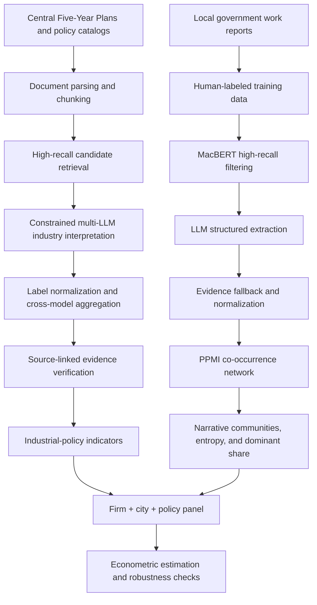
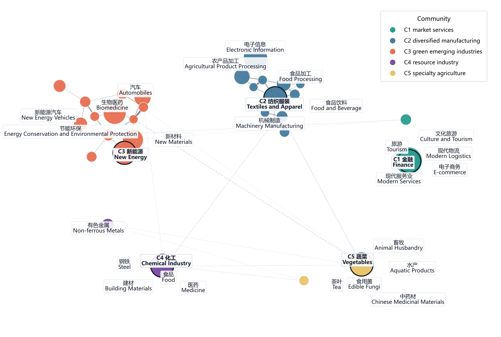
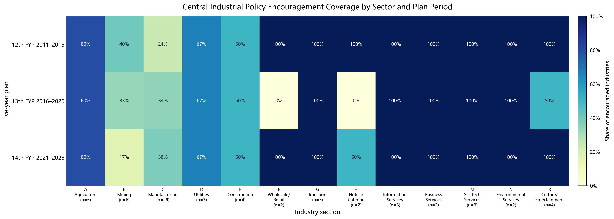
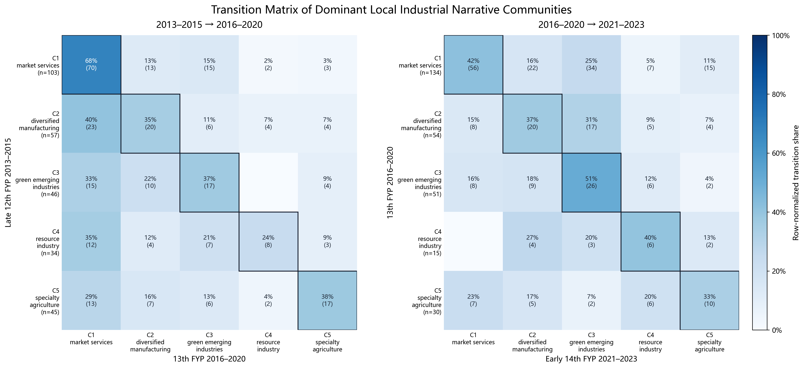
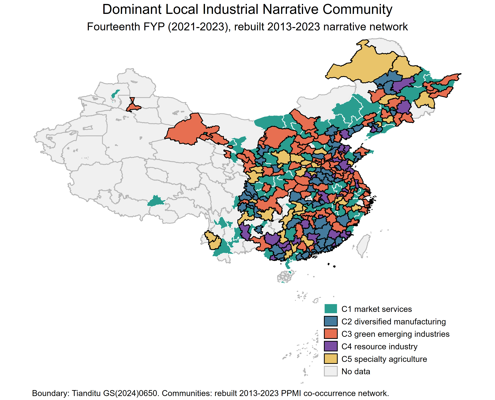

# Evidence-Grounded LLM Pipeline for Industrial Policy and Local Government Text Analysis

This repository presents the public research pipeline developed for my working paper *Industrial Policy, Local Industrial Narratives, and Corporate Digital Transformation*. The project combines long-document retrieval, high-recall neural filtering, structured LLM extraction, multi-model validation, evidence-linked auditing, network-based text analysis, and downstream econometric evaluation.

To protect unpublished research materials, this public version omits original corpora, full production prompts, private dictionaries, credentials, case-level validation records, and selected tuning parameters, while preserving the architecture, module design, representative outputs, and reproducibility logic of the research workflow.

## Project Overview

The project studies how centrally encouraged industrial policies are translated into local industrial narratives, and how those narratives relate to firms' digital transformation. The private research workflow links three layers of evidence:

- central industrial policy texts, including Five-Year Plan materials and industrial adjustment catalogs
- prefecture-level government work reports used to recover local industrial narratives
- firm, city, industry, policy, and text-derived panel variables used for econometric estimation

The core contribution is not a standalone chatbot. It is a measurement pipeline that turns long policy and government-report text into auditable, source-linked indicators that can be evaluated quantitatively.

## Research Pipeline



## Representative Research Outputs

The figures below are selected aggregate outputs from the research workflow. They are included to show the end-to-end path from text processing to measurement, not to release the underlying private corpora or case-level annotations.

### Local Industrial Narrative Network



### Central Policy Coverage by Industry



### Narrative Community Transition Matrix



### Spatial Distribution of Dominant Local Narratives



## Main Technical Components

### Industrial Policy Extraction

- plan document parsing and chunking
- high-recall industry candidate retrieval
- constrained multi-LLM semantic labeling
- whitelist-constrained industry normalization
- cross-model aggregation and disagreement checks
- policy-action intensity construction by plan period and industry

See [research_pipeline/ip](research_pipeline/ip/README.md).

### Government Report Pipeline

- human-labeled training set construction
- MacBERT high-recall filtering for candidate report spans
- report-level recall corpus construction
- structured LLM extraction with constrained fields
- evidence fallback and normalization
- audit tables for recall, label coverage, and noisy cases

See [research_pipeline/local_reports](research_pipeline/local_reports/README.md).

### Network Measurement

- industry term normalization
- PPMI co-occurrence network construction
- robust community detection
- city-year narrative entropy
- dominant community and dominant-community share
- transition and spatial visualization

See [research_pipeline/network](research_pipeline/network/README.md).

### Downstream Evaluation

- firm-city-policy panel assembly
- text-derived policy and narrative indicators
- baseline panel regressions
- mechanism and heterogeneity tests
- bootstrap, Conley, and robustness checks
- appendix audit outputs for measurement quality

See [research_pipeline/evaluation](research_pipeline/evaluation/README.md).

## Public Code Example

A small synthetic example is included to demonstrate the code interfaces without exposing unpublished materials. It is deliberately separate from the research data and production prompt stack.

Browser demo:

```text
open index.html
```

Python prototype using only the standard library:

```bash
python examples/run_synthetic_pipeline.py --json
python -m unittest discover -s tests
```

Optional dense retrieval interface:

```bash
pip install -r requirements-optional.txt
python examples/run_synthetic_pipeline.py --retriever dense --json
```

The default example uses synthetic documents and local mock LLM adapters. The optional OpenAI-compatible adapter reads configuration from environment variables and is provided only to show the model-backend boundary.

## Public / Private Boundary

| Public | Not released |
| --- | --- |
| pipeline architecture | raw policy/report corpora |
| module-level workflow descriptions | full production prompts |
| representative aggregate figures | private dictionaries and whitelist tables |
| synthetic runnable example | API credentials and runtime configuration |
| schema and audit logic examples | case-level validation records |
| reproducibility map | selected tuning parameters |

Full reproduction of the unpublished paper requires private corpora, annotation resources, and licensed empirical datasets that are not publicly released. See [docs/reproducibility.md](docs/reproducibility.md) and [RELEASE_BOUNDARY.md](RELEASE_BOUNDARY.md).

## Repository Map

- `assets/research/`: selected aggregate research figures
- `research_pipeline/`: sanitized module-level workflow descriptions
- `docs/`: methodology and reproducibility notes
- `src/evidence_pipeline/`: replaceable Python RAG/LLM pipeline prototype
- `examples/run_synthetic_pipeline.py`: synthetic CLI example
- `tests/`: standard-library smoke tests
- `index.html`, `app.js`, `styles.css`: interactive browser example
- `data/synthetic_documents.json`: synthetic corpus for public testing
- `schema/demo_output_schema.json`: public constrained output schema
