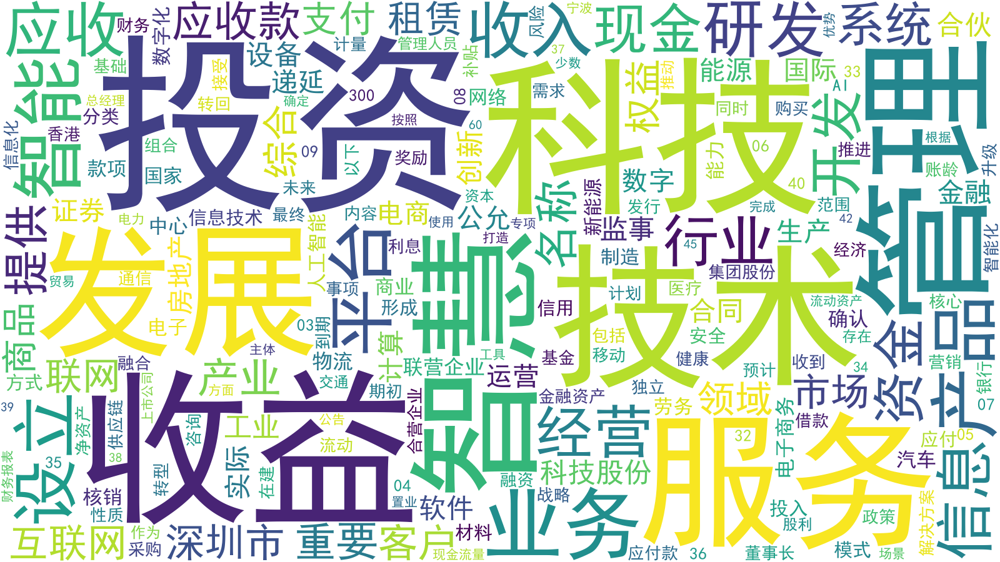

# Annual Report Digitalization Measurement

This module documents the public structure of annual-report digitalization measurement.

## Role in the Project

Annual-report analysis provides firm-year text-derived measures that are used downstream in empirical evaluation. This layer is separate from the LLM-based structured extraction pipeline used for policy and government-report semantic measurement.

## Methods

- dictionary-based digitalization language counting
- LDA as an auxiliary traditional topic-modeling method for exploratory checks
- year-level and firm-year aggregation
- comparison with downstream empirical variables

## Method Boundary

LDA is a traditional topic-modeling method. It is not treated as an LLM method in this repository. The LLM stages are constrained semantic interpretation, structured extraction, multi-model comparison, and evidence-linked verification.

## Supplementary Visualization

The word cloud is retained only as a descriptive supplementary visualization. It is not used as a core README figure because it does not distinguish LDA, ML, or LLM methods.

